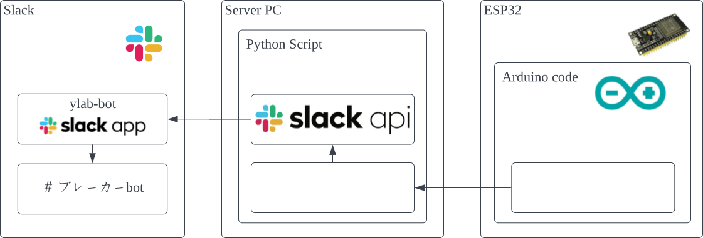
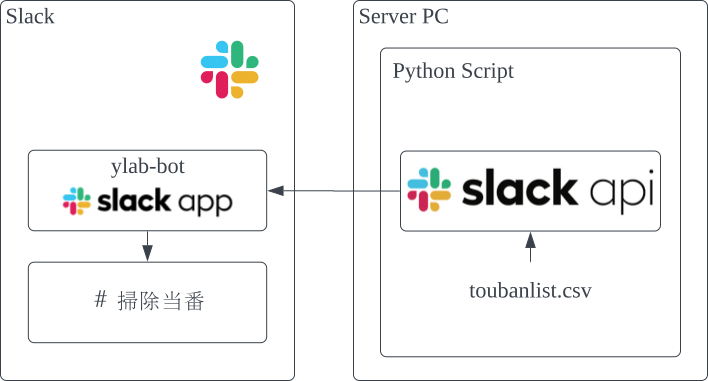

# Description
This is a repo for tools used in [Robot Task System and Laboratory in Shibaura Institute of Technology](https://www.shibaura-it.ac.jp/en/research/laboratory/00242.html).
This tools is made public to allow others to use our tools for references in making their own laboratory tools.

# Tools included in this repo
## Minnadoko 
A simple WebApp to notify member's location. \
We have several laboratory in our university campus, and the original method of using magnets doesn't really make sense anymore when some members only work in one lab most of the time.
## BreakerBot
Send slack notifications when the laboratory breaker is turned on or off. (We have a rule to turn off the breaker when nobody is in the laboratory and turn it on in the morning.)
## SoujiBot
Send slack reminder every week for the person in charge of cleaning up the lab.

# Running this app
1. Install [docker](https://docs.docker.com/engine/install/) in any environment.
2. git clone this repo ```git clone https://github.com/ykris152/ylab-bots.git```
3. make your own <code>.env</code> file \
the <code>.env</code>> should include a these:
```
# breakerbot & soujibot
SLACK_API_TOKEN=<slack token generated from the slack app>
# frontend
BACKEND_URL=http://<url of the postgrest container>:3000/members
TOKEN=<jwt token generated for postgrest read the link below>
# postgrest
PGRST_DB_URI=postgresql://postgres:password@<ip address of postgres db>:5432/minnadokodb
PGRST_OPENAPI_SERVER_PROXY_URI=http://127.0.0.1:3000
PGRST_JWT_SECRET=<jwt secret generated also refer to the link below>
PGRST_DB_SCHEMAS=api
# point-counter
DB_URL=postgresql://postgres:password@<ip address of postgres db>:5432/minnadokodb
# db
POSTGRES_USER=<username for postgres>
POSTGRES_PASSWORD=<password for postgres>
```
for jwt token & secret key refer to [this](https://postgrest.org/en/v12/references/auth.html). (If you have time please implement [External JWT Generation](https://postgrest.org/en/v12/integrations/jwt_gen.html))

4. compose up the apps ```docker compose up -d```
5. Once the deployment of containers are finished, run a setup script for the db. \
<code>./minnadoko\postgres\bin\setup.sh</code> \
modifiy the schema <code>minnadoko\postgres\sql\schema.sql</code> \
and modify the seed <code>minnadoko\postgres\sql\seed.sql</code> \
for your use case.

# Architecture
## Minnadoko
ToDo :)
## BreakerBot
Send slack notifications when the breaker is turned on or off in the lab.



## SoujiBot
Send slack notifications to the person in charge of cleaning up the lab.

